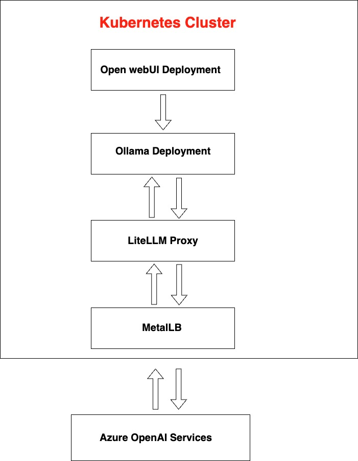

# Open WebUI and Ollama Deployment Guide

This guide provides detailed instructions for deploying Open WebUI and Ollama on a local Kubernetes cluster using Minikube. It includes steps for setting up storage, deploying applications, configuring services, and integrating Azure-hosted models.

## Architecture Diagram

Below is the architecture diagram illustrating the communication flow between different components in the project:



## Minikube Setup

1. **Start Minikube**:
   - Start Minikube with a specific driver (e.g., Docker):
     ```bash
     minikube start --driver=docker
     ```

2. **Access Services**:
   - Use `minikube service <service-name> --url` to get the URL for accessing your services locally.

By following these steps, you can set up and run your applications on a local Kubernetes cluster using Minikube. This setup is ideal for development and testing purposes.

## Step 1: Set Up Storage

1. **Create a Persistent Volume Claim (PVC) for Open WebUI:**
   - Request storage for your pods using a PVC.
   - See `openwebui-pvc.yaml` for the configuration.

2. **Create a Persistent Volume Claim (PVC) for Ollama:**
   - Request storage for your pods using a PVC.
   - See `ollama-pvc.yaml` for the configuration.

## Step 2: Deploy Ollama and Open WebUI

1. **Create a Deployment for Ollama:**
   - Define a deployment for Ollama.
   - See `ollama-deployment.yaml` for the configuration.

2. **Create a Deployment for Open WebUI:**
   - Define a deployment for Open WebUI.
   - See `openwebui-deployment.yaml` for the configuration.

## Step 3: Set Up Services

1. **Create a Service for Ollama:**
   - Expose Ollama using a Kubernetes Service.
   - See `ollama-service.yaml` for the configuration.

2. **Create a Service for Open WebUI:**
   - Expose Open WebUI using a Kubernetes Service.
   - See `openwebui-service.yaml` for the configuration.

## Step 4: Deploy the Applications

- Apply the YAML files using `kubectl`:
  ```bash
  kubectl apply -f openwebui-pvc.yaml
  kubectl apply -f ollama-pvc.yaml
  kubectl apply -f ollama-deployment.yaml
  kubectl apply -f openwebui-deployment.yaml
  kubectl apply -f ollama-service.yaml
  kubectl apply -f openwebui-service.yaml
  ```

## Step 5: Install MetalLB

1. **Deploy MetalLB**:
   - Install MetalLB using the following command:
     ```bash
     kubectl apply -f https://raw.githubusercontent.com/metallb/metallb/v0.14.9/config/manifests/metallb-native.yaml
     ```

2. **Configure MetalLB**:
   - After deploying MetalLB, apply the configuration to define the IP address range:
     ```bash
     kubectl apply -f metallb-config.yaml
     ```

### YAML Files Required:
- **`metallb-native.yaml`**: Used to deploy MetalLB in your cluster.
- **`metallb-config.yaml`**: Defines the IP address range for MetalLB to use.

## Step 6: Integrate Azure Models with Ollama

1. **Deploy LiteLLM Proxy**:
   - Deploy the LiteLLM Proxy in the `openwebui-system` namespace to bridge Azure-hosted models with Ollama's local API.
   - See `litellm-deployment.yaml` for the deployment configuration.

2. **Configure LiteLLM Proxy**:
   - Use a ConfigMap to store the configuration for the LiteLLM Proxy, specifying the Azure model details.
   - See `litellm-configmap.yaml` for the configuration.

3. **Expose LiteLLM Proxy**:
   - Expose the LiteLLM Proxy using a LoadBalancer service with MetalLB to allow external access.
   - See `litellm-service.yaml` for the service configuration.

4. **Update Ollama WebUI**:
   - Configure Ollama WebUI to use the LiteLLM Proxy as the API endpoint, using the external IP provided by MetalLB.

5. **Apply Configurations**:
   - Apply all configurations using `kubectl`:
     ```bash
     kubectl apply -f litellm-deployment.yaml
     kubectl apply -f litellm-configmap.yaml
     kubectl apply -f litellm-service.yaml
     ```

**LiteLLM Summary**:
LiteLLM is a proxy tool that allows integration of Azure-hosted AI models with local applications like Ollama WebUI. It translates Azure AI API requests into a format compatible with OpenAI-style requests, enabling seamless interaction between Azure models and local interfaces. This setup leverages both cloud-based AI services and local deployment capabilities, providing flexibility and scalability in AI model management.

**Communication Summary**:
- **Internal Communication**: Pods communicate using Kubernetes services, which provide DNS resolution and load balancing. The Open WebUI pod interacts with the Ollama pod for model management and with the LiteLLM Proxy for accessing Azure-hosted models.
- **External Communication**: The LiteLLM Proxy requires external access to communicate with Azure AI services, facilitated by a LoadBalancer service using MetalLB. This allows external clients to access the proxy.
- **LoadBalancer Service**: Ensures scalability and reliability by distributing requests across LiteLLM Proxy replicas and providing an external IP for access. 